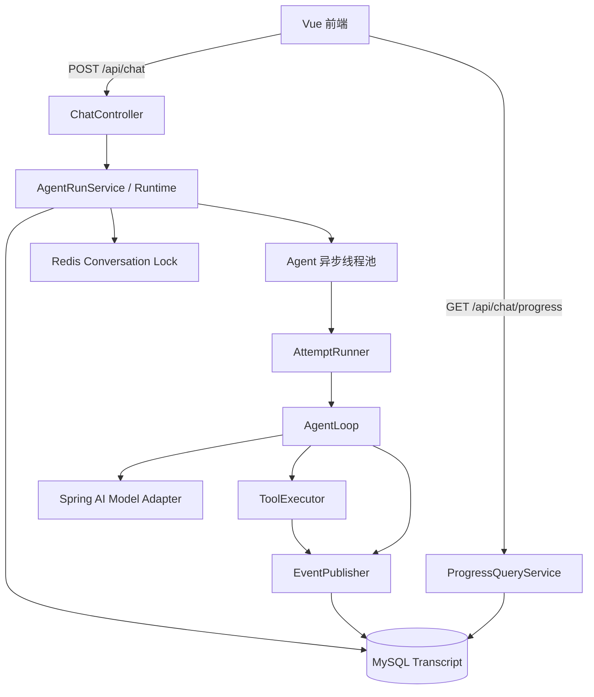
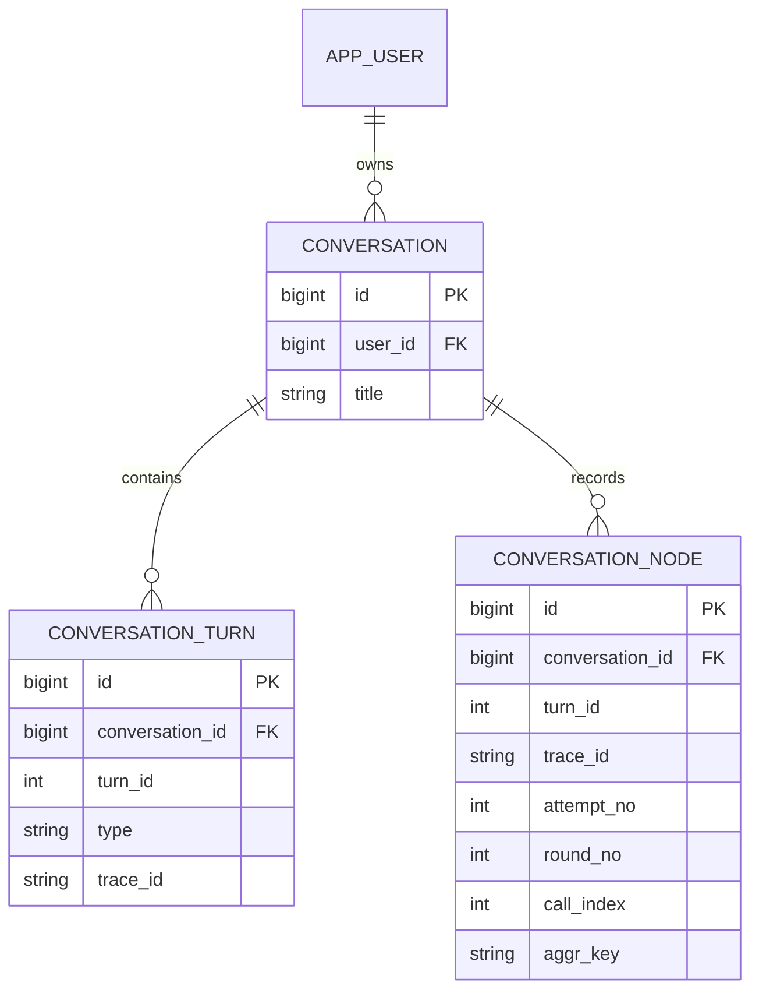

# AgentLoop MVP v1 最终设计稿

> 版本：MVP v1  
> 定稿日期：2026-08-16  
> 适用工程：`E:\ai\code\code\ai-agent-backend`、`E:\ai\code\code\ai-agent-frontend`  
> 核心目标：实现一个真正可用的 AgentLoop，使系统具备跨轮短期记忆、手动 Tool Calling、工具异常自修复和执行过程可视化能力。

## 1. 文档定位

本文是 M4/M5 AgentLoop 初版实现的设计基线，可直接交给新的 Codex/Claude Code 会话作为编码依据。

“最终设计稿”指当前里程碑内的实现契约已经确定，不代表代码上线后不能根据调试结果继续演进。实现阶段可以修复错误、调整局部字段和补充测试，但如果要改变核心数据语义、消息重建顺序或 AgentLoop 生命周期，应先更新本文。

本设计综合参考：

-  `conversation / conversation_turn / conversation_node` 模型。
- 本地 Codex 源码中的 Turn、Tool follow-up、rollout 和 compaction 思路。
- 本地 OpenClaw 源码中的 Runtime、Attempt Loop、Agent Loop、事件流和会话串行机制。
- 当前个人项目的 Java 17、Spring Boot 3.5.16、Spring AI 1.1.7、MySQL 8.4、Redis 7、Vue 3 技术栈。

发生冲突时，本文的 MVP 契约优先。

## 2. 范围

### 2.1 本期必须完成

- 用户维度的会话创建、列表、切换、软删除和历史查询。
- 一个会话包含多个 Turn，一个 Turn 对应一次用户问答。
- 后端异步执行 AgentLoop，POST 接口快速返回 `conversationId + turnId + traceId`。
- 前端轮询当前 Turn，展示中间消息和 Tool 步骤卡片。
- 手动控制模型与 Tool 的循环，关闭 Spring AI 自动 Tool 执行。
- 支持一个模型响应包含多个 Tool Call。
- Tool START 与 SUCCESS/ERROR 使用 `aggrKey=toolCallId` 配对。
- Tool 失败不直接结束 InnerLoop，错误作为 Tool Result 回注模型。
- 从数据库重建最近对话历史，实现重启后继续聊天。
- 同一会话只允许一个活动 Turn。
- 正常、异常、线程池拒绝和重启残留都必须形成终态，前端不能永久停在 REASONING。
- 首批 Tool：`current_time`、`calculate`、`query_conversation_node`。

### 2.2 本期明确不做

- 上下文摘要与压缩。
- 长期记忆、向量数据库和 RAG。
- Skill 系统。
- SubAgent/MultiAgent。
- 等待用户 Tool、审批状态和 `WAITING_USER`。
- 用户取消 Run。
- 模型供应商 Failover 和认证配置轮换。
- 副作用 Tool，例如发消息、支付、创建外部任务。
- Token 级流式输出和 SSE。
- 多实例后台任务队列。

这些能力以后增加时，不应破坏本文的 canonical transcript 和 Node 事件语义。

## 3. 统一术语

| 概念 | 定义 | 本期标识 |
| --- | --- | --- |
| HTTP Session | 登录态，由 Spring Session 存 Redis | Cookie Session ID |
| Conversation | 用户看到的一段长期聊天 | `conversation.id` |
| Turn | 一条用户消息到一个最终助手回答 | `(conversation_id, turn_id)` |
| Run | 后台执行一个 Turn 的实例 | `trace_id` |
| Attempt | Run 内一次完整 InnerLoop 尝试 | `attempt_no` |
| Round | 一次模型调用及其 Tool Call 批次 | `round_no` |
| Tool Call | 模型要求执行一次工具 | `aggr_key=toolCallId` |
| Node Event | Agent 执行过程中的一次状态变化 | `conversation_node.id` |

HTTP Session 与 Conversation 必须在命名上严格区分。Agent Core 不接收原始 `HttpSession`，只接收已经解析的 `userId` 和运行上下文。

## 4. 总体架构



分层职责：

- Controller：参数校验、登录用户解析、HTTP 状态与 DTO。
- Runtime：会话归属、Redis 锁、Turn 创建、异步提交、异常兜底。
- AttemptRunner：最多两次可恢复 Attempt。
- AgentLoop：模型调用、Tool 执行、消息推进和停止判断。
- ContextManager：从 DB 重建历史，控制历史预算。
- ToolExecutor：Tool 查找、ToolContext 注入、同步执行、错误包装。
- EventPublisher：Node 事件写入抽象。
- TurnFinalizer：以事务方式写 assistant 终态与 GENERATE 终态。
- ProgressQueryService：把数据库原始事件投影为 `single/multiple` 前端结构。

## 5. 数据模型

本期只新增三张核心表：

```text
conversation
conversation_turn
conversation_node
```

暂不增加 `agent_run` 和 `conversation_node_output`。`trace_id + lifecycle nodes` 代表 Run；Node `content` 使用 `LONGTEXT` 保存完整内容，接口层负责生成预览。后续数据规模扩大后可以把大字段拆到独立输出表。

### 5.1 `conversation`

一段用户可见的聊天对应一行。

```sql
CREATE TABLE IF NOT EXISTS `conversation` (
    `id` BIGINT NOT NULL AUTO_INCREMENT,
    `user_id` BIGINT NOT NULL,
    `title` VARCHAR(200) DEFAULT NULL,
    `source` VARCHAR(32) NOT NULL DEFAULT 'web',
    `is_deleted` TINYINT NOT NULL DEFAULT 0,
    `created_at` DATETIME NOT NULL DEFAULT CURRENT_TIMESTAMP,
    `updated_at` DATETIME NOT NULL DEFAULT CURRENT_TIMESTAMP ON UPDATE CURRENT_TIMESTAMP,
    PRIMARY KEY (`id`),
    KEY `idx_conversation_user_updated` (`user_id`, `is_deleted`, `updated_at`, `id`),
    CONSTRAINT `fk_conversation_user`
        FOREIGN KEY (`user_id`) REFERENCES `app_user` (`id`)
) ENGINE=InnoDB DEFAULT CHARSET=utf8mb4 COLLATE=utf8mb4_unicode_ci;
```

约束：

- 所有会话查询必须同时包含 `user_id` 与 `is_deleted=0`。
- 无权访问和不存在统一返回 404，不能泄露其他用户会话是否存在。
- 首个 Turn 创建时，标题取当前 query 清理空白后的前 50 个 Unicode 字符，只生成一次。
- 每次 Turn 最终完成或失败时更新 `updated_at`，用于侧边栏排序。
- 删除只更新 `is_deleted=1`，本期不物理删除 Turn 与 Node。

### 5.2 `conversation_turn`

一轮问答完成后应恰好有一条 user 和一条 assistant。Run 执行期间允许暂时只有 user。

```sql
CREATE TABLE IF NOT EXISTS `conversation_turn` (
    `id` BIGINT NOT NULL AUTO_INCREMENT,
    `conversation_id` BIGINT NOT NULL,
    `turn_id` INT NOT NULL,
    `type` VARCHAR(16) NOT NULL,
    `content` LONGTEXT NOT NULL,
    `is_hidden` TINYINT NOT NULL DEFAULT 0,
    `error_message` VARCHAR(1000) DEFAULT NULL,
    `trace_id` VARCHAR(64) NOT NULL,
    `feedback_type` TINYINT DEFAULT NULL,
    `created_at` DATETIME NOT NULL DEFAULT CURRENT_TIMESTAMP,
    `updated_at` DATETIME NOT NULL DEFAULT CURRENT_TIMESTAMP ON UPDATE CURRENT_TIMESTAMP,
    PRIMARY KEY (`id`),
    UNIQUE KEY `uk_conversation_turn_type` (`conversation_id`, `turn_id`, `type`),
    KEY `idx_conversation_turn_order` (`conversation_id`, `turn_id`, `id`),
    KEY `idx_conversation_turn_trace` (`trace_id`),
    CONSTRAINT `fk_conversation_turn_conversation`
        FOREIGN KEY (`conversation_id`) REFERENCES `conversation` (`id`)
) ENGINE=InnoDB DEFAULT CHARSET=utf8mb4 COLLATE=utf8mb4_unicode_ci;
```

`type` 本期只写：

- `user`
- `assistant`

未来 `summary` 不直接混入普通 Turn 消息；实现压缩时应重新评估是否增加 checkpoint 表。

写入规则：

- POST 接口事务内先写 user。
- AgentLoop 结束后才写 assistant。
- assistant 正常完成时 `error_message=NULL`。
- assistant 异常终止时 `content` 写用户可见的稳定错误文案，`error_message` 写截断后的内部错误摘要。
- `trace_id` 在同一 Turn 的 user、assistant 和所有 Node 上保持一致。
- 模型需要非空占位时只在内存模型消息中使用 `"."`，不能把占位符当成真实用户内容写入数据库。

### 5.3 `conversation_node`

Node 是 append-only 过程事件。每次状态变化插入一行，不更新旧状态行。

```sql
CREATE TABLE IF NOT EXISTS `conversation_node` (
    `id` BIGINT NOT NULL AUTO_INCREMENT,
    `conversation_id` BIGINT NOT NULL,
    `turn_id` INT NOT NULL,
    `trace_id` VARCHAR(64) NOT NULL,
    `attempt_no` SMALLINT NOT NULL DEFAULT 1,
    `round_no` INT DEFAULT NULL,
    `call_index` INT DEFAULT NULL,
    `node_id` VARCHAR(64) NOT NULL,
    `node_name` VARCHAR(128) NOT NULL,
    `aggr_key` VARCHAR(128) DEFAULT NULL,
    `type` VARCHAR(32) NOT NULL,
    `status` VARCHAR(16) NOT NULL,
    `content` LONGTEXT,
    `created_at` DATETIME NOT NULL DEFAULT CURRENT_TIMESTAMP,
    `updated_at` DATETIME NOT NULL DEFAULT CURRENT_TIMESTAMP ON UPDATE CURRENT_TIMESTAMP,
    PRIMARY KEY (`id`),
    KEY `idx_node_turn_order` (`conversation_id`, `turn_id`, `id`),
    KEY `idx_node_turn_aggr` (`conversation_id`, `turn_id`, `aggr_key`, `id`),
    KEY `idx_node_trace_round` (`trace_id`, `attempt_no`, `round_no`, `id`),
    CONSTRAINT `fk_conversation_node_conversation`
        FOREIGN KEY (`conversation_id`) REFERENCES `conversation` (`id`)
) ENGINE=InnoDB DEFAULT CHARSET=utf8mb4 COLLATE=utf8mb4_unicode_ci;
```

字段语义：

- `trace_id`：本次 Run 标识，使用 UUID。
- `attempt_no`：OuterLoop 尝试序号，从 1 开始。
- `round_no`：InnerLoop 模型调用序号，从 1 开始；Run 级 lifecycle 可为空。
- `call_index`：同一模型响应中 Tool Call 的原始下标，从 0 开始；非 Tool 事件可为空。
- `node_id`：稳定节点标识，Tool 使用工具名，其他使用 `lifecycle`、`assistant_reply`、`generate`。
- `node_name`：前端展示名称。
- `aggr_key`：一次 Tool Call 的 `toolCallId`；同一 Tool 的 START 与终态完全相同。
- `content`：完整事件内容。接口层默认只返回受限预览；查询 Tool 可按权限读取完整内容。

`type` 本期使用：

- `LIFECYCLE`
- `TOOL_CALL`
- `ASSISTANT_REPLY`
- `GENERATE`

该字段使用字符串而不是数据库 ENUM，未来可增加 `SKILL_SELECT` 等类型，前端对未知类型必须有通用展示降级。

`status` 本期使用：

- `INFO`
- `START`
- `SUCCESS`
- `ERROR`
- `COMPLETE`

Node 的 `updated_at` 本期通常等于 `created_at`。字段保留用于与现有参考接口保持一致，但不能依赖更新旧行表达状态变化。

## 6. 数据关系和不变量



必须长期保持的不变量：

1. 完成或失败的 Turn 恰好有一条 user 和一条 assistant。
2. 同一 Conversation 的 `turn_id` 单调递增。
3. Tool START 必须先于工具实际执行落库。
4. Tool SUCCESS/ERROR 必须在结果回注模型前落库。
5. 同一个 Tool Call 的 START 和 SUCCESS/ERROR 共用 `aggr_key`。
6. 同一模型响应中的多个 Tool Call 共用 `round_no`，按 `call_index` 保持原始顺序。
7. Node 原始写入顺序以自增 `id` 为准，不以完成时间推断 Tool Call 顺序。
8. `GENERATE/COMPLETE` 只有在 assistant 终态已成功写入后才可见。
9. `GENERATE/ERROR` 只有在 error assistant 终态已成功写入后才可见。
10. 原始 Tool 数据不因接口展示截断而丢失。

## 7. Turn 状态

本期不在数据库新增独立 Turn status 字段。`turnStatus` 是查询接口根据终态数据得到的投影：

| 状态 | 判定 |
| --- | --- |
| `REASONING` | 已有 user，但没有终态 GENERATE，也没有 assistant 终态 |
| `COMPLETE` | 有 assistant 且有 `GENERATE/COMPLETE` |
| `ERROR` | 有 error assistant 或 `GENERATE/ERROR` |

不实现 `GENERATING`。当前模型调用非 Token 流式，轮询无法稳定观察该状态。

终态写入必须通过 `TurnFinalizer` 在同一个数据库事务中完成：

```text
正常：
1. insert assistant turn
2. insert GENERATE/COMPLETE node
3. update conversation.updated_at
4. commit

失败：
1. insert assistant turn with error_message
2. insert GENERATE/ERROR node
3. update conversation.updated_at
4. commit
```

如果事务回滚，不能向前端暴露半个终态。

## 8. 会话并发与 Turn ID

### 8.1 Redis 会话锁

同一 Conversation 同时只允许一个活动 Turn。

- Key：`agent:conversation:lock:{conversationId}`
- Value：本次 `traceId`
- 获取：Redis `SET key traceId NX PX ttl`
- 释放：Lua 脚本比较 value 等于当前 traceId 后删除
- TTL：必须大于 `maxRunDuration`，建议 Run 上限 5 分钟、锁 TTL 10 分钟

获取失败时 POST 返回 HTTP 409，提示当前会话正在执行。

本期不实现锁续期。若未来允许超过锁 TTL 的长任务，必须增加 watchdog 或任务队列。

### 8.2 Turn ID 分配

获得 Redis 锁后，在数据库事务中：

1. 通过 `conversation.id + user_id + is_deleted=0` 查询并锁定 Conversation 行。
2. 查询该 Conversation 当前最大 `turn_id`。
3. 新 `turn_id = max + 1`。
4. 插入 user turn。
5. 首轮为空标题时生成标题。
6. 提交事务。

数据库唯一键作为最终并发兜底。不能在未持有会话锁时单独执行 `MAX(turn_id)+1`。

## 9. 异步提交生命周期

`POST /api/chat` 的流程：

```text
校验登录和 query
  -> 查询或创建当前用户 Conversation
  -> 获取 Redis 会话锁
  -> 事务创建 user turn 和 traceId
  -> 事务提交
  -> 提交 Agent 异步任务
  -> 返回 202 Accepted
```

重要边界：

- `@Async` 方法必须位于另一个 Spring Bean，避免同类调用导致代理失效。
- 异步线程不能依赖 SecurityContext 自动传播，必须显式传入 `userId`。
- Agent 线程池必须有界，例如 core=2、max=4、queue=100；最终数值配置化。
- 如果线程池拒绝或提交动作抛异常，Controller/Runtime 必须调用 `TurnFinalizer.fail(...)`，然后释放 Redis 锁。
- 异步任务最外层使用 `try/catch/finally`，所有异常都转成终态，`finally` 释放当前 traceId 持有的锁。

POST 成功响应：

```json
{
  "conversationId": 123,
  "turnId": 2,
  "traceId": "uuid",
  "turnStatus": "REASONING"
}
```

HTTP 状态使用 `202 Accepted`。

## 10. ExecutionContext

一次 Run 对应一个不可变身份上下文和一个可变的内存消息工作集。

```text
AgentExecutionContext
├── userId
├── conversationId
├── turnId
├── traceId
├── currentQuery
├── historyMessages
├── workingMessages
├── modelConfig
├── toolCallbacks
├── maxAttempts
├── maxToolRounds
├── deadline
└── cancellation/deadline check
```

本期不把 HTTP Session、Controller DTO 或 JDBC Connection 放入 ExecutionContext。

ToolContext 包含：

```text
userId
conversationId
turnId
traceId
attemptNo
roundNo
toolCallId
```

模型不能提供或覆盖这些系统字段。

## 11. 短期记忆与历史重建

### 11.1 Canonical store

MySQL 是聊天历史和过程事件的唯一真相来源。Redis 只保存登录 Session 和会话运行锁，不作为消息持久化来源。

每个 Run 开始时从 DB 构造历史快照；Run 内后续 Round 使用内存 `workingMessages` 推进，不在每个 Round 全量重查数据库。

### 11.2 历史选择

历史查询必须：

- 只查询当前 `userId` 拥有的 Conversation。
- 排除当前 `turnId`。
- 排除尚未形成 user+assistant 两条终态的残留 Turn。
- 过滤 `is_hidden=1` 的消息；若 user 或 assistant 任一缺失，整个历史 Turn 不注入。
- 最多选择最近 50 个完整 Turn。
- 同时受 `maxHistoryTokens` 限制，从最新 Turn 向前选择，最后按 `turn_id ASC` 发送模型。

建议配置：

```yaml
agent:
  memory:
    max-history-turns: 50
    max-tool-pairs-per-turn: 3
    max-tool-args-preview-chars: 300
    max-tool-result-preview-chars: 500
    max-history-tokens: 24000
```

`maxHistoryTokens` 初版可以使用保守字符估算，后续替换为模型 tokenizer。

### 11.3 每个历史 Turn 的消息顺序

```text
user query
  -> assistant(tool calls of round N)
  -> tool result 1
  -> tool result 2
  -> ...
  -> assistant final answer
```

Tool 对来源：

1. 查询该 Turn 的 `TOOL_CALL` Node。
2. 按 `aggr_key` 配对 START 与最新终态 SUCCESS/ERROR。
3. 只保留配对完整的 Tool Call。
4. 选择模型顺序中最后 3 个完整 Tool 对，再按 `(round_no, call_index)` 升序重放。
5. 同一 `round_no` 的 Tool Call 重建为同一条 assistant tool-call message。
6. Tool Result 按 `call_index` 原顺序追加，而不是按完成时间追加。

选择最后 3 对是本期预算策略。完整结果仍保留在 Node 表，可由查询 Tool 按需读取。

### 11.4 截断必须保持合法结构

不能直接把 Tool arguments JSON 截断成非法字符串。超限时使用合法 JSON 占位：

```json
{
  "_truncated": true,
  "preview": "原始参数预览",
  "toolCallId": "call_xxx",
  "lookupHint": "Use query_conversation_node for full content"
}
```

Tool Result 超限时也使用结构化 JSON：

```json
{
  "success": true,
  "truncated": true,
  "preview": "结果预览",
  "toolCallId": "call_xxx"
}
```

当前 query 已经落 user turn，但历史查询必须排除当前 `turn_id`，然后只在 `workingMessages` 末尾追加一次当前 user message。

## 12. Tool 系统

### 12.1 Tool 定义与装配

- 使用 Spring AI `@Tool` 声明工具方法。
- 启动 AgentLoop 前将工具转换为 `ToolCallback` 列表。
- 模型请求携带 Tool Definition，但必须关闭框架自动执行。
- Spring AI 1.1.7 的手动 Tool Call API 在编码前要通过本地依赖源码或最小测试确认，不能凭其他版本 API 猜测。
- AgentLoop 只依赖项目自己的 `ModelAdapter`，避免 Spring AI 消息类型泄漏到整个领域层。

### 12.2 ToolExecutor

统一入口：

```text
ToolExecutor.execute(toolCall, ToolContext)
  -> 按名字查找 ToolCallback
  -> 写 TOOL_CALL/START
  -> 调用工具
  -> 标准化 JSON 结果
  -> 写 TOOL_CALL/SUCCESS 或 ERROR
  -> 返回模型可接收的 ToolResult
```

硬约束：

- START 写入失败时不能执行 Tool。
- SUCCESS/ERROR 写入失败时本次 Run 直接失败，不能假装结果已持久化。
- Tool 抛出的普通异常转换为错误 Tool Result，InnerLoop 继续。
- 数据库写入异常、线程中断、整体超时属于 Run 级异常，不包装为普通 Tool 业务结果。
- 返回给模型的错误内容不能包含堆栈、密钥、SQL 密码或内部绝对路径。

标准错误 Tool Result：

```json
{
  "success": false,
  "is_error": true,
  "error": "用户可理解且已脱敏的错误信息"
}
```

模型协议没有独立 `is_error` 字段时，将它保留在 JSON 内容中。

### 12.3 多 Tool Call

本期支持一个模型响应返回多个 Tool Call。

执行规则：

1. 先按模型原始顺序为所有 Call 写 START，设置相同 `round_no` 和不同 `call_index`。
2. 使用有界的专用 Tool 线程池并行执行。
3. 每个 Tool 完成后在自己的同步执行路径立即写 SUCCESS/ERROR，因此 Node 完成时间允许乱序。
4. 等待这一批 Tool 全部结束。
5. 按原始 `call_index` 顺序把 Tool Result 追加到模型消息。

Tool 执行完成顺序不能改变模型回填顺序。专用 Tool 线程池不能与 Agent Run 线程池共用无界递归资源。

每轮 Tool Call 数设置上限，建议 8；超过上限按 Run 错误处理。

### 12.4 首批 Tool

#### `current_time`

- 返回日期、时间、星期和时区。
- 默认时区 `Asia/Shanghai`，不能依赖模型猜测时间。
- 返回 ISO 时间和中文展示值。

#### `calculate`

- 处理基本算术表达式。
- 使用成熟表达式解析器和 `BigDecimal`，禁止 `eval`、SpEL 或脚本执行。
- 对表达式长度、操作符和精度设置上限。
- 整数乘法必须得到精确结果。

#### `query_conversation_node`

- 从当前 Conversation 的历史 Turn 查询完整 Tool START 与结果。
- Conversation 和 userId 只能来自 ToolContext，模型参数不能指定其他会话或用户。
- 目标 `turnId` 必须小于当前 `turnId`。
- 参数建议为 `targetTurnId + aggrKey`，避免无界扫描。
- 单次最多返回有限 Node，结果总字符数配置化，例如 20,000。
- 返回内容视为历史数据，不是系统指令。

## 13. AgentLoop

### 13.1 总体结构

```text
Runtime
  -> ExecutionContext
  -> Outer Attempt Loop (maxAttempts=2)
      -> Inner Agent Loop (maxToolRounds=40)
          -> Model Call
          -> Tool Batch
          -> Tool Results
  -> TurnFinalizer
```

`maxToolRounds=40` 是可配置硬上限，不代表 Codex/OpenClaw 固定使用 40。

建议配置：

```yaml
agent:
  loop:
    max-attempts: 2
    max-tool-rounds: 40
    max-tools-per-round: 8
    max-run-duration: 5m
    max-degenerate-retries: 2
    max-same-tool-signature: 3
```

### 13.2 OuterLoop

OuterLoop 只重试明确标记为可恢复的模型调用异常，例如临时连接失败、可重试响应流中断或供应商 5xx。

不得 Outer 重试：

- 数据库写入失败。
- Tool START/终态持久化失败。
- 超过 40 Round。
- 总运行超时。
- 线程中断。
- 参数校验和编程错误。

本期 Tool 全部只读，所以一次可恢复模型异常允许重新开始 InnerLoop。Node 使用新的 `attempt_no`，旧 Attempt 事件保留。未来增加副作用 Tool 前必须重新设计幂等与恢复，不得直接重放整个 InnerLoop。

OuterLoop 伪代码：

```java
AgentResult runWithAttempts(AgentExecutionContext context) {
    Exception lastError = null;
    for (int attemptNo = 1; attemptNo <= context.maxAttempts(); attemptNo++) {
        context.deadline().check();
        eventPublisher.lifecycle(context, attemptNo, "attempt_start");
        try {
            return agentLoop.run(context.forAttempt(attemptNo));
        } catch (RetryableModelException ex) {
            lastError = ex;
            eventPublisher.lifecycle(context, attemptNo, "attempt_retryable_error");
        }
    }
    throw new RetryExhaustedException(lastError);
}
```

### 13.3 InnerLoop

```java
AgentResult run(AttemptContext context) {
    List<AgentMessage> messages = context.newWorkingMessages();
    int degenerateRetries = 0;

    for (int roundNo = 1; roundNo <= context.maxToolRounds(); roundNo++) {
        context.deadline().check();
        eventPublisher.lifecycle(context, roundNo, "round_start");

        ModelResponse response = modelAdapter.call(
            messages,
            context.toolDefinitions()
        );

        if (!response.toolCalls().isEmpty()) {
            if (response.toolCalls().size() > context.maxToolsPerRound()) {
                throw new TooManyToolCallsException();
            }

            messages.add(response.asAssistantToolCallMessage());
            if (isMeaningful(response.text())) {
                eventPublisher.assistant(context, roundNo, response.text());
            }

            List<ToolResult> results = toolBatchExecutor.execute(
                response.toolCalls(),
                context,
                roundNo
            );
            messages.addAll(resultsInOriginalCallOrder(results));
            degenerateRetries = 0;
            continue;
        }

        if (isTrivial(response.text())) {
            if (degenerateRetries < context.maxDegenerateRetries()) {
                degenerateRetries++;
                messages.add(internalNudgeMessage());
                continue;
            }
            throw new EmptyModelResponseException();
        }

        messages.add(response.asAssistantMessage());
        return AgentResult.completed(response.text());
    }

    throw new ToolRoundLimitExceededException();
}
```

模型产生 Tool Call 时，assistant tool-call message 必须在 Tool Result 之前加入消息列表。一个响应中的所有 Tool Result 回填完成后才能进入下一 Round。

### 13.4 退化轮与 nudge

平凡正文至少包括：

- `null`
- 空字符串或纯空白
- 只有 `.`、`。` 等无语义占位

nudge 是本次 Run 的内部临时消息，不写 `conversation_turn`，也不伪装成用户真实历史。若底层模型协议支持 developer/system continuation，优先使用该角色；不支持时才使用带内部元数据的临时 user message。

建议文案：

```text
上一轮未生成有效正文且没有调用工具。若需要信息，请调用可用工具；否则请直接给出最终答案。
```

连续两次 nudge 后仍退化，Turn 以 ERROR 结束，不能把空内容标成 COMPLETE。

### 13.5 重复 Tool 检测

按以下签名统计：

```text
toolName + canonicalJson(arguments)
```

同一 Run 连续出现相同签名达到 3 次且没有产生新信息时终止，避免撞满 40 Round。初版可以先实现简单连续计数，不要求 OpenClaw 级别的复杂检测。

## 14. EventPublisher

AgentLoop 依赖接口，不直接写 JDBC：

```java
public interface EventPublisher {
    void lifecycle(...);
    void toolStart(...);
    void toolEnd(...);
    void assistant(...);
    void generate(...);
}
```

DB 实现映射：

| 方法 | type | status |
| --- | --- | --- |
| `lifecycle` | `LIFECYCLE` | `INFO` |
| `toolStart` | `TOOL_CALL` | `START` |
| `toolEnd` 成功 | `TOOL_CALL` | `SUCCESS` |
| `toolEnd` 失败 | `TOOL_CALL` | `ERROR` |
| `assistant` | `ASSISTANT_REPLY` | `SUCCESS` |
| `generate` 正常 | `GENERATE` | `COMPLETE` |
| `generate` 失败 | `GENERATE` | `ERROR` |

`ASSISTANT_REPLY` 表示模型在调用 Tool 前后输出的阶段性说明，不是隐藏 Chain of Thought。前端文案使用“助手消息”或“执行说明”，不能声称展示模型私有思考。

`generate` 的数据库写入由 `TurnFinalizer` 协调，保证 assistant 终态和 GENERATE 终态同事务提交。

## 15. Progress/getCurrentTurn 接口

### 15.1 请求

```http
GET /api/chat/progress?conversationId=123&turnId=2
```

必须根据当前登录 `userId` 校验 Conversation 归属，无权访问返回 404。

### 15.2 返回

```json
{
  "conversationId": 123,
  "turnId": 2,
  "traceId": "uuid",
  "turnStatus": "REASONING",
  "finalAnswer": null,
  "errorMessage": null,
  "nodeList": [
    {
      "structureType": "single",
      "dbId": 100,
      "nodeId": "assistant_reply",
      "nodeName": "助手回复",
      "nodeType": "ASSISTANT_REPLY",
      "nodeStatus": "SUCCESS",
      "content": "我先查询当前时间。",
      "createdTime": "...",
      "updatedTime": "..."
    },
    {
      "structureType": "multiple",
      "aggrKey": "call_abc",
      "nodeId": "current_time",
      "nodeName": "current_time",
      "nodeType": "TOOL_CALL",
      "nodeStatus": "SUCCESS",
      "createdTime": "...",
      "updatedTime": "...",
      "nodeList": [
        { "dbId": 101, "nodeStatus": "START", "content": "..." },
        { "dbId": 103, "nodeStatus": "SUCCESS", "content": "..." }
      ]
    }
  ]
}
```

### 15.3 Node 聚合

数据库仍然是一行一个事件，`structureType` 只在接口 DTO 中产生。

聚合算法：

1. 查询当前 Turn 所有 Node，按 `id ASC`。
2. `aggr_key IS NULL` 的事件输出为 `single`。
3. `aggr_key IS NOT NULL` 的事件按 `aggr_key` 聚合为 `multiple`。
4. multiple 子事件按 `id ASC`。
5. multiple 在顶层的位置取其最早子事件 `MIN(id)`。
6. multiple 的 `createdTime` 取 START 时间，`updatedTime` 取最后终态时间。
7. multiple 的状态：有 ERROR 为 ERROR；否则有 SUCCESS 为 SUCCESS；否则为 START。
8. 顶层所有 single/multiple 最终按各自首个事件 ID 升序。

不能按 SUCCESS 完成时间排列 Tool 卡片，否则并行 Tool 会改变模型原始调用顺序。

### 15.4 内容预览

Node 表存完整内容，但 progress 接口必须限制：

- Tool 入参预览建议 1,000 字符。
- Tool 结果预览建议 2,000 字符。
- 超限返回 `truncated=true`。
- 完整内容由 `query_conversation_node` 在模型侧按需读取；未来可增加专用详情接口。

## 16. 会话接口

初版至少提供：

```text
POST   /api/chat
GET    /api/chat/progress
GET    /api/conversations
GET    /api/conversations/{conversationId}/turns
DELETE /api/conversations/{conversationId}
```

约定：

- `POST /api/chat` 的 `conversationId` 为空时创建新 Conversation。
- 会话列表按 `updated_at DESC, id DESC`。
- Turn 历史只展示 user/assistant 终态，不直接展示原始 Node。
- 软删除后继续访问该会话返回 404。
- 所有 Repository 查询都必须带当前 userId，不能只在 Controller 做一次鉴权。

## 17. 前端设计

### 17.1 页面结构

- 左侧会话栏：新建会话、会话列表、切换、删除。
- 主区：历史 user/assistant 消息。
- 当前运行区：中间助手消息和 Tool 步骤卡片。
- 输入区：运行期间当前会话禁止重复提交；可以切换查看其他会话。

### 17.2 轮询

- POST 成功后立即进入 REASONING。
- 每 1.5 秒轮询 progress，允许配置在 1 到 2 秒。
- REASONING 继续轮询。
- COMPLETE 读取 finalAnswer，停止轮询并刷新会话列表。
- ERROR 显示错误，停止轮询。
- 页面刷新后，如果最新 Turn 仍是 REASONING，恢复轮询。
- 切换会话和组件卸载时清理旧定时器，防止多个轮询并发。
- 同一次响应按 `dbId/aggrKey` 去重，避免卡片重复。

Tool 卡片至少展示：

- 工具名。
- START、SUCCESS、ERROR 状态。
- 入参预览。
- 结果或错误预览。
- 开始与完成时间。

## 18. 异常与恢复

### 18.1 统一终态原则

以下路径必须调用 `TurnFinalizer.fail`：

- 异步线程池提交失败。
- OuterLoop 重试耗尽。
- InnerLoop 达到 40 Round。
- 模型返回连续退化结果。
- 数据库或事件持久化失败。
- 总运行超时。
- 未捕获异常。
- 正常停机时仍在运行的任务。

稳定用户文案示例：

```text
本次处理未能完成，请稍后重试。
```

内部错误摘要写 `error_message`，最长 1000 字符。

### 18.2 重启残留恢复

`@PreDestroy` 只能处理正常停机，不能覆盖崩溃。因此应用启动时执行恢复：

1. 查询存在 user、但不存在 assistant 的 Turn。
2. 当前进程启动后不存在任何可继续这些 Run 的内存任务，因此它们全部视为残留。
3. 为每个残留 Turn 事务补写 error assistant 与 `GENERATE/ERROR`。
4. 不重跑旧 Tool，不自动恢复旧 Run。
5. Redis 旧锁依赖 TTL 到期；恢复过程可在确认 traceId 后删除属于残留 Run 的锁。

恢复逻辑必须幂等。assistant 唯一键和终态检查保证重复启动不会重复补写。

### 18.3 正常停机

- 停止接收新任务。
- 等待线程池在有限时间内结束。
- 未结束任务补 ERROR。
- 释放自己持有的 Redis 锁。

不能宣称该机制覆盖强制杀进程。

## 19. 安全要求

- 所有会话、Turn、Node 查询均以当前 `userId` 作为必要条件。
- `query_conversation_node` 不接受模型指定的 userId/conversationId。
- Tool 参数、结果和模型错误进入日志前进行长度限制与脱敏。
- 不保存或展示模型隐藏推理。
- Tool Result 作为不可信数据回注模型，不允许改变系统指令优先级。
- calculate 禁止执行代码。
- 数据库内容返回前进行 JSON/HTML 安全处理，Vue 默认文本渲染，不使用未净化的 `v-html`。
- Redis 锁只能由持有相同 traceId 的任务释放。

## 20. 可观测性

日志公共字段：

```text
userId
conversationId
turnId
traceId
attemptNo
roundNo
toolCallId
toolName
```

建议记录：

- Run 总耗时。
- 每次模型调用耗时和 Token usage。
- Tool 执行耗时。
- Attempt 重试原因。
- 最终状态。

生命周期内容可先采用可读字符串，后续改为结构化 JSON。不能把日志文本作为业务状态唯一来源。

## 21. 推荐包结构

```text
com.jam.agent
├── controller
│   ├── ChatController
│   └── ConversationController
├── dto
│   ├── chat
│   ├── conversation
│   └── progress
├── agent
│   ├── runtime
│   │   ├── AgentRunService
│   │   ├── AgentExecutionContext
│   │   ├── AttemptRunner
│   │   └── TurnFinalizer
│   ├── loop
│   │   ├── AgentLoop
│   │   ├── ModelAdapter
│   │   └── AgentMessage
│   ├── memory
│   │   └── ConversationContextManager
│   ├── event
│   │   ├── EventPublisher
│   │   └── DatabaseEventPublisher
│   └── tool
│       ├── ToolExecutor
│       ├── ToolBatchExecutor
│       ├── AgentToolContext
│       └── builtin
├── repository
│   ├── ConversationRepository
│   ├── ConversationTurnRepository
│   └── ConversationNodeRepository
├── service
│   ├── ConversationService
│   └── ProgressQueryService
└── config
    ├── AgentAsyncConfig
    └── AgentProperties
```

包名可以根据实际代码适当调整，但 Runtime、Loop、Memory、Tool、Event 五个职责边界应保留。

## 22. 实现顺序

1. 在 `schema.sql` 追加三表 DDL，并完成 Repository 集成测试。
2. 实现 Conversation/Turn API、用户隔离和侧边栏。
3. 实现 Redis 会话锁、Turn 创建与异步线程池。
4. 建立项目内部 AgentMessage 和 ModelAdapter，先跑通无 Tool 最终回答。
5. 实现 EventPublisher 和 progress 聚合。
6. 实现 ToolExecutor 与三个内置 Tool。
7. 实现多 Tool 并行和按原序回填。
8. 实现 AgentLoop、nudge、Round 限制与错误分类。
9. 实现 DB 历史重建和 Tool 对回填。
10. 实现启动残留恢复与正常停机补偿。
11. 完成前端轮询、步骤卡片和刷新恢复。
12. 完成端到端验收、更新里程碑与迭代历史。

每个阶段遵循 build -> run -> verify，不要一次写完所有代码后才联调。

## 23. 测试要求

### 23.1 AgentLoop 单元测试

- 无 Tool Call，直接正常结束。
- 单 Tool Call 后正常结束。
- 一个响应多个 Tool Call，完成乱序但回填原序。
- Tool 抛异常，模型收到错误结果并继续。
- 连续退化响应触发 nudge。
- nudge 耗尽进入 ERROR。
- 达到 Round 上限进入 ERROR。
- 可恢复模型异常触发第二 Attempt。
- 不可恢复异常不重试。
- 重复 Tool 签名检测。

### 23.2 数据与接口集成测试

- 每个完成 Turn 恰好 user+assistant 两条。
- Tool START 与终态 aggrKey 相同。
- Progress 正确聚合 single/multiple。
- 并行 Tool 不按完成时间打乱卡片顺序。
- COMPLETE 出现时 assistant 已可读取。
- ERROR 后前端状态不再 REASONING。
- 当前 Turn 不重复进入历史。
- 历史只加载当前用户会话。
- A 用户访问 B 用户会话返回 404。
- 同一 Conversation 并发 POST 一个成功、一个 409。
- 线程池拒绝后形成 ERROR 终态。
- 启动恢复能补齐残留 Turn 且幂等。

### 23.3 前端测试

- 新建、切换和删除会话。
- 轮询期间步骤卡片增量出现。
- COMPLETE/ERROR 停止轮询。
- 页面刷新恢复正在运行的 Turn。
- 切换会话不会残留旧轮询。
- 长 Tool 内容不会撑破布局。

## 24. 验收标准

1. 问“现在几点？今天星期几？”时，模型调用 `current_time` 后正确回答。
2. 问“帮我算 345678*912345 的精确值”时，模型调用 `calculate`，结果准确。
3. 一个模型响应返回多个 Tool Call 时，Node 可以完成乱序，但模型 Tool Result 回填保持原顺序。
4. 执行过程中前端能看到助手阶段消息和 Tool START/SUCCESS/ERROR 卡片。
5. COMPLETE 或 ERROR 后停止轮询，不永久转圈。
6. 第二轮“刚才那个结果再乘 2”能从历史获得上轮结果并继续计算。
7. 重启后端后，已完成会话可以继续聊天。
8. 重启前未完成的 Turn 被补成 ERROR，不永久停留 REASONING。
9. 用户 A 访问用户 B 的会话返回 404。
10. 完成 Turn 的 `conversation_turn` 恰好增加两行。
11. Tool Node 保存完整入参与结果，progress 只返回安全预览。
12. 人为让 Tool 抛异常后，AgentLoop 不立即中断，模型能看到结构化错误并调整。

## 25. 新会话接手说明

新会话开始实现前必须按顺序读取：

1. `E:\ai\code\code\AGENTS.md`
2. `E:\ai\code\code\ai-agent-backend\AGENTS.md`
3. `E:\ai\code\code\ai-agent-backend\docs\里程碑.md`
4. 本设计稿
5. 当前前后端源码和 git status

实现约束：

- 未经用户明确“开始”，不要修改代码。
- 不以旧 Prompt 覆盖本文已经定稿的三表、状态和异常语义。
- 编码前先验证 Spring AI 1.1.7 手动 Tool Calling 的实际 API。
- 不修改用户已有未提交内容。
- 不在本期擅自加入压缩、RAG、Skill、SubAgent 或取消功能。
- 显著阶段完成后 build、run、verify，再更新 `docs/里程碑.md` 和 `docs/迭代历史/`。
- 是否 commit/push 以用户当时明确要求为准。

## 26. 最终架构结论

MVP v1 的核心是：

```text
三张 canonical 表
+ 数据库历史重建
+ Redis 会话串行锁
+ Outer Attempt Loop
+ Inner Model/Tool Loop
+ append-only Node 事件
+ DB 轮询进度
+ 所有路径统一终态
```

它已经足以形成一个可用 Agent：能记住前文、调用工具、从工具错误中调整、展示执行过程，并在服务重启后继续已有会话。

后续能力应围绕这套核心增量扩展，而不是在第一版同时引入完整 Agent Runtime 的所有复杂性。
