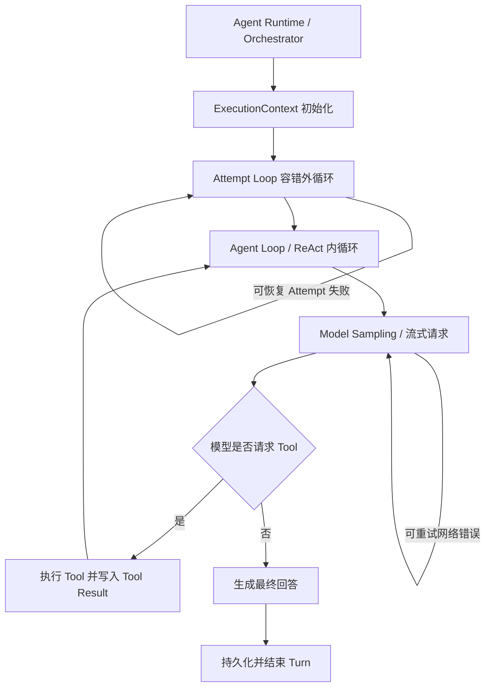

# Codex 与 OpenClaw 的 Agent Loop 实现调研

> 调研日期：2026-08-16  
> 调研对象：本机源码快照 `E:\ai\code\code2\codex-main`、`E:\ai\code\code2\openclaw\openclaw-main`  
> 目标：为个人 Agent 项目的 Agent Loop、短期记忆、上下文压缩和等待用户机制提供设计依据。

## 1. 先给结论

### 1.1 对“点小数”分层的判断

“一次问答对应一个 `executionContext`，外循环负责容错，内循环负责思考与工具调用”是合理且适合当前项目的定义。需要补充两点：

1. 这是一套项目自己的术语，不是所有框架对 `outer loop`、`inner loop` 的统一命名。OpenClaw 的不同模块就使用了不同含义的“外循环”。
2. Agent 内循环并不只是执行 Tool。一次 Step 的完整过程是“组装上下文 -> 调用模型 -> 判断 Tool Call -> 执行 Tool -> 写回 Tool Result”，Tool Call 是决定是否继续下一 Step 的关键信号。

建议把系统明确分成以下层级：



在这套定义中：

- Runtime/Orchestrator：鉴权、创建 Run、加载历史、建立 `ExecutionContext`、排队、并发控制、超时、取消、总预算、事件流。
- Attempt Loop：处理一次 Run 内可恢复的失败，例如模型供应商故障、鉴权配置轮换、模型降级、上下文溢出恢复。
- Agent Loop：模型与 Tool 之间反复交互，直到模型不再请求 Tool，或遇到终止条件。
- Sampling Retry：更内层的 HTTP/流式响应重试，不应算成一次新的 ReAct Step。

因此，用户提出“加载跨轮上下文、管理超时、取消和总预算属于外循环之外”是成立的。更准确地说，它们是 Runtime 的职责，虽然 Attempt Loop 和 Agent Loop 都会读取这些控制信号。

### 1.2 短期记忆的结论

“存表 + 上下文压缩 + Agent Loop”是服务端 Agent 短期记忆的核心，但还少两个必需环节：

1. **Context Assembly**：每次模型调用前，根据会话、压缩检查点、最近消息、系统提示词和 Tool 结果，构造真正发给模型的上下文。
2. **一致性控制**：同一会话必须串行执行或使用版本号/写入者令牌，防止两个 Run 同时追加消息、压缩或覆盖上下文。

数据库也不是理论上的唯一选择。Codex 使用 JSONL 保存本地 canonical history，OpenClaw 当前版本使用 SQLite 保存会话和 transcript。对当前 Web 项目而言，MySQL 是最合适的 canonical store，Redis 继续承担登录 Session、锁、缓存和临时运行状态，不建议把 Redis 当聊天记录的唯一真相来源。

### 1.3 `WAITING_USER` 的结论

`WAITING_USER` 与最终输出在传输层都可能表现为“后端向前端发一段内容”，但运行语义不同：

| 项目 | 最终输出 | 等待用户 |
| --- | --- | --- |
| 当前 Turn | 已结束 | 尚未结束或等待恢复 |
| 未完成 Tool Call | 没有 | 有，正在等 Tool Result |
| 用户下一条消息 | 新 Turn | 可作为当前 Tool Call 的结果，继续原 Turn |
| Run 状态 | `SUCCEEDED` | `WAITING_USER` 或进程内阻塞 |
| 超时处理 | 不需要 | 需要超时、取消或默认答案 |

Codex 和 OpenClaw 的通用提问 Tool 都采用“当前 Tool 调用阻塞等待”的方式，并非先返回最终答案再开新 Turn。OpenClaw 的通用问题状态明确只在进程内保存，重启后不能恢复。因此 `WAITING_USER` 不是 Agent Loop MVP 的必选项，也不是成熟框架必然采用的持久化状态。

当前项目建议：第一版 Agent Loop 暂不提供主动询问用户的 Tool。将来产品确实需要审批、补参数或多选问答时，再选择以下方案之一：

- 简单方案：SSE/WebSocket 保持 Run，内存中等待用户，进程重启后该请求失败。
- 可恢复方案：持久化 pending question 和 `WAITING_USER`，释放执行线程；用户回答后创建恢复任务，从未完成 Tool Call 继续原 Turn。

对于普通 Spring MVC 请求，不建议让工作线程长期阻塞等待用户。

## 2. 建议统一的领域术语

讨论 Agent Loop 前，建议先固定以下 ID 和生命周期，否则“Session”“轮次”“外循环”很容易混用。

| 概念 | 建议定义 | 生命周期 |
| --- | --- | --- |
| HTTP Session | 登录态，Spring Session 存 Redis | 多个页面请求 |
| Conversation / Chat Session | 用户看到的一段聊天 | 多个 Turn |
| Turn | 一条用户输入到一个最终回答 | 一次问答 |
| Run | 执行一个 Turn 的运行实例 | 通常一个 Turn 对应一个 Run |
| Attempt | Run 内的一次模型/供应商执行尝试 | 失败后可重试或切模型 |
| Step | 一次模型采样及其产生的一批 Tool Call | Agent Loop 的一次迭代 |
| Tool Execution | 某个 Tool Call 的实际执行 | Step 内部 |
| Message/Event | 用户消息、助手消息、Tool Call、Tool Result 等事实记录 | 持久化 |

这里的 `Session` 至少有两个不同含义：登录 HTTP Session 与聊天 Conversation。建议在代码中不要只写 `sessionId`，而是使用 `httpSessionId`、`conversationId` 等明确名称。

同样，不建议把整个 `HttpSession` 对象传进 Agent Core。Agent Core 真正需要的是稳定的 `userId`、权限快照和 `conversationId`。用户名可用于展示，但不能作为数据关联主键。

## 3. `ExecutionContext` 应如何理解

### 3.1 它是一次 Run 的工作上下文

“点小数”的 `executionContext` 可以直接沿用，但建议定义为一次 Run 的上下文，而不是跨所有会话长期存在的大对象。它可以包含：

```text
ExecutionContext
├── identity
│   ├── userId
│   ├── conversationId
│   ├── turnId
│   └── runId
├── request
│   ├── currentUserMessage
│   ├── modelConfig
│   └── toolDefinitions
├── context
│   ├── historySnapshot
│   ├── activeSummary/checkpoint
│   └── inRunMessageBuffer
├── runtime control
│   ├── cancellationToken
│   ├── deadline
│   ├── totalTokenBudget
│   ├── maxAttempts
│   └── maxSteps
└── services/references
    ├── messageRepository
    ├── contextManager
    ├── modelClient
    ├── toolRegistry
    └── eventPublisher
```

### 3.2 `sessionStore(messageList)` 应该是引用和快照，不应复制全部真相

如果 `sessionStore` 指内存中的 `messageList`，它适合作为本次 Run 的工作集，但数据库应是跨请求、跨进程的 canonical store。

推荐运行方式：

1. Run 开始时，从 MySQL 加载“有效压缩摘要 + 未被摘要覆盖的近期消息”。
2. 形成 `historySnapshot`，在 Run 内存中持续追加。
3. 每产生一条用户消息、助手 Tool Call、Tool Result 或最终回答，同步追加到内存和数据库。
4. 下一次模型调用优先使用内存工作集，不要每个 Step 都全量查库。
5. Run 结束后释放内存；下一个 Turn 再从持久化状态重建。

因此，`ExecutionContext` 可以“包含完成一次问答所需的全部信息”，但其中很多内容应是 ID、快照或服务引用，而不是复制所有全局状态。

## 4. Codex Agent Loop 源码分析

### 4.1 任务层循环：处理运行中到达的新输入

文件：`E:\ai\code\code2\codex-main\codex-rs\core\src\tasks\regular.rs`

- 第 76 行进入循环。
- 第 77 行调用 `run_turn`。
- 第 86 行检查输入队列是否还有 pending input。
- 没有新输入时返回；有新输入时再次运行 Turn 处理流程。

这个循环不是容错循环，也不是纯 Tool Loop。它用于吸收 Agent 运行期间用户追加的输入。

### 4.2 `run_turn`：Codex 的模型/Tool 主循环

文件：`E:\ai\code\code2\codex-main\codex-rs\core\src\session\turn.rs`

- 第 281 行进入主循环。
- 第 350 至 363 行从 Session history 构造模型输入并调用 `run_sampling_request`。
- 第 379 至 405 行合并模型的 `needs_follow_up` 与 pending user input。
- 第 451 至 479 行在需要继续且达到上下文限制时执行自动压缩，然后继续循环。
- 第 482 行在 `needs_follow_up == false` 时进入结束流程。

Codex 的核心停止条件不是“达到固定 40 轮”，而是：

- 模型不再产生需要 follow-up 的 Tool Call；
- 没有 pending user input；
- 被取消或中断；
- 达到上下文、会话预算或服务限制；
- 遇到不可恢复错误；
- Hook 或安全策略要求停止。

### 4.3 Sampling 层还有独立的网络重试

同一文件中的 `run_sampling_request` 还有一个更内层循环，用于处理 provider/stream 的可重试错误。它不应该计为新的 Agent Step，因为模型还没有完成一次有效的“思考 -> 行动”决策。

这验证了一个重要设计原则：

- HTTP 断流、连接失败等由 Model Client/Sampling Retry 处理。
- 模型或供应商级恢复由 Attempt Loop 处理。
- Tool Call 推进由 Agent Loop 处理。

三类重试必须分开计数，否则日志和预算会失真。

### 4.4 Codex 如何等待用户

文件：

- `E:\ai\code\code2\codex-main\codex-rs\core\src\tools\handlers\request_user_input.rs`
- `E:\ai\code\code2\codex-main\codex-rs\core\src\session\mod.rs`
- `E:\ai\code\code2\codex-main\codex-rs\core\src\session\handlers.rs`

`request_user_input` 是一个真实 Tool。`Session::request_user_input` 在 `session/mod.rs` 第 2652 行开始：

- 第 2660 行创建 oneshot channel。
- 第 2667 行把 pending request 放入当前 active turn state。
- 第 2676 行发出 `RequestUserInput` 事件。
- 第 2687 行等待 `rx_response.await`。

UI 返回答案后，handler 找到 pending sender 并回填，原 Tool 才返回 Tool Result，Agent Loop 才继续。

所以 Codex 的行为是“同一个 Turn 内挂起等待”，不是“最终回答后另起一轮”。该状态主要依赖当前进程的 active turn，并不是一个通用的、可跨重启恢复的 `WAITING_USER` 状态机。

### 4.5 Codex 的短期记忆与持久化

文件：

- `E:\ai\code\code2\codex-main\codex-rs\core\src\session\mod.rs`
- `E:\ai\code\code2\codex-main\codex-rs\thread-store\README.md`

`Session::record_conversation_items` 从 `session/mod.rs` 第 3018 行开始：

- 第 3044 至 3052 行更新内存 history。
- 第 3061 至 3063 行转换为 rollout items 并持久化。
- 随后向客户端发送事件。

恢复会话时，`apply_rollout_reconstruction` 从第 1455 行开始，根据 rollout 重建内存 history。

`thread-store/README.md` 第 22 至 27 行说明本地实现的职责：

- JSONL 保存 canonical history。
- SQLite 保存可查询 metadata。
- `RolloutRecorder` 是 JSONL writer。

这不是传统 Web 项目的 `message` 表实现，但语义完全一致：**持久化事实记录，在新进程或恢复时重建模型上下文。**

### 4.6 Codex 的上下文压缩

文件：`E:\ai\code\code2\codex-main\codex-rs\core\src\compact.rs`

- `run_compact_task_inner_impl` 从第 240 行开始。
- 第 271 行循环请求模型生成摘要。
- 第 309 至 317 行如果压缩请求本身上下文溢出，会删除最旧 history item 后重试。
- 第 347 至 354 行收集用户消息并构造新的压缩 history。
- 第 374 行调用 `replace_compacted_history`。
- `build_compacted_history` 从第 639 行开始，保留 token 预算内的近期用户消息，再追加 summary。

`Session::replace_compacted_history` 位于 `session/mod.rs` 第 3309 行：

- 替换当前内存 history。
- 创建包含 `replacement_history` 的 `CompactedItem`。
- 第 3342 行把压缩检查点写入 rollout。

关键思想是：原始 rollout 是事实记录，压缩后用于模型的 history 是派生视图，并通过检查点支持恢复。

## 5. OpenClaw Agent Loop 源码分析

### 5.1 OpenClaw 官方项目文档中的定义

文件：`E:\ai\code\code2\openclaw\openclaw-main\docs\concepts\agent-loop.md`

第 9 至 11 行将 Agent Loop 定义为每个 Session 串行执行的一次 Run，涵盖消息接入、上下文组装、模型推理、Tool 执行、流式输出和持久化。

第 20 至 24 行描述了运行流程：

- Gateway `agent` RPC 先返回 `{runId, acceptedAt}`。
- 后台执行 `runEmbeddedAgent`。
- `agent.wait` 按 `runId` 等待 lifecycle end/error。

第 28 至 30 行强调同一 Session 串行执行，并使用持久化 `activeWriterRunId` 防止过期 Run 写回 transcript。

这说明 OpenClaw 把“Agent Loop”当作较宽的产品运行生命周期；阅读具体实现时仍需继续拆层。

### 5.2 Runtime 准备在容错循环之前

核心文件：`E:\ai\code\code2\openclaw\openclaw-main\src\agents\embedded-agent-runner\run-loop.ts`

- 第 93 行附近开始准备 Runtime。
- 第 113 至 115 行注释明确：Admission 只在 retry loop 之前解析一次，之后把同一个 admitted context 传给各个 attempt/recovery owner。
- 第 314 行才进入 `while (true)` 容错循环。

这与“点小数”的边界一致：用户身份、Session、工作区、模型配置、队列、Hook、运行控制器和上下文引擎等先形成执行上下文，然后 Attempt Loop 才开始。

### 5.3 OpenClaw 的 Attempt/Recovery 外循环

`run-loop.ts` 第 314 行的 `while (true)` 是最符合当前讨论中“外循环”的实现：

- 每次开始一个 run attempt。
- 分发实际的 embedded run attempt。
- 根据结果决定完成、重试、认证配置轮换、模型 fallback、压缩恢复或失败。
- 第 316 至 330 行检查 retry budget，耗尽后进入 fallback 或返回错误。

重试预算由 `src/agents/embedded-agent-runner/run/retry-budget.ts` 管理，并区分正常进度 continuation 与 recovery。不是每次继续都消耗容错预算。

因此，当前项目可以把这一层正式命名为 `AttemptLoop` 或 `RecoveryLoop`，避免只叫含义模糊的 `outerLoop`。

### 5.4 OpenClaw 的 Tool/ReAct 内循环

核心文件：`E:\ai\code\code2\openclaw\openclaw-main\packages\agent-core\src\agent-loop.ts`

源码注释直接给出两层循环：

- 第 350 至 351 行：Outer loop 用于 Agent 本来要停止后到达的 queued follow-up messages。
- 第 354 至 355 行：Inner loop 用于 Tool Calls 和 steering messages。

内循环的关键步骤：

1. 第 367 至 379 行注入 pending messages。
2. 第 386 至 395 行调用 `streamAssistantResponse`。
3. 第 407 至 414 行只有 `stopReason == toolUse` 且存在 Tool Call 时才执行 Tool。
4. 第 422 至 434 行把 Tool Result 加入当前 context。
5. 第 424 行设置是否还有更多 Tool Call。
6. 第 442 至 460 行在 Tool Loop 检测要求终止时结束 Run。
7. 第 520 至 524 行没有更多消息时结束 Agent。

这里出现了一个命名冲突：`agent-core` 自己称 follow-up queue 为 outer loop，但 embedded runner 的更外层还有 Attempt/Recovery Loop。因此文档和代码设计必须写全名，不能只说“外循环”。

`src/agents/embedded-agent-runner/run/attempt-execution-phase.ts` 第 148 行的注释也明确写道：`activeSession.prompt(...)` 会启动它自己的 Agent Loop。

### 5.5 OpenClaw 没有固定 40 Step

在本地源码中没有发现 Codex 或 OpenClaw 把 Tool/ReAct 循环固定限制为 40 次。OpenClaw 使用：

- Run retry budget 控制 Attempt 恢复。
- Tool Loop detection 检测重复调用和无进展行为。
- post-compaction loop guard 防止压缩后继续死循环。
- 总运行超时、模型 idle timeout、取消信号和上下文预算。

当前项目仍然应该配置 `maxSteps`，因为自己的 MVP 暂时不会实现完整的 loop detection。建议第一版从 12 到 20 个 Step 开始，而不是直接把 40 当作默认值。40 可以作为可配置硬上限，但不能替代 token、时间、Tool 次数和重复调用检测。

### 5.6 OpenClaw 的会话持久化

相关文件：

- `E:\ai\code\code2\openclaw\openclaw-main\src\agents\sessions\session-manager-persistence.ts`
- `E:\ai\code\code2\openclaw\openclaw-main\src\agents\sessions\session-manager-core.ts`
- `E:\ai\code\code2\openclaw\openclaw-main\src\config\sessions\session-accessor.sqlite-transcript-write.ts`
- `E:\ai\code\code2\openclaw\openclaw-main\src\state\openclaw-agent-db.generated.d.ts`

`SessionManagerPersistence` 的行为：

- 第 144 至 147 行检测 persistence target，存在时写 SQLite。
- 第 155 行进入 `persistSqliteRecord`。
- 第 165 至 180 行确保 Session header 已落库。
- 第 193 至 204 行持久化非 message 事件。
- 第 206 至 218 行持久化 message。

`SessionManagerCore.replacePersistedTranscript` 在 `session-manager-core.ts` 第 514 行开始，通过 `replaceTranscriptEventsSync` 重写当前持久化 transcript。

生成的数据库类型显示 `transcript_events` 至少包含：

- `session_id`
- `seq`
- `event_json`
- `created_at`

当前 OpenClaw 版本的 active transcript 使用 SQLite。老版本或兼容路径仍可能出现 JSONL，但 `docs/concepts/compaction.md` 第 127 至 129 行明确说明，当前 active compaction target 是 SQLite transcript，legacy JSONL checkpoint 不是 active target。

### 5.7 OpenClaw 的上下文压缩

文件：`E:\ai\code\code2\openclaw\openclaw-main\docs\concepts\compaction.md`

关键规则：

- 第 9 至 15 行：把较旧 Turn 总结为 compact entry，并保留近期消息。
- 第 17 行：选择切分点时保持 Tool Call 与 Tool Result 配对。
- 第 19 行：完整会话历史仍保留在磁盘，压缩只改变下一轮模型看到的内容。
- 第 25 至 31 行：safeguard 模式会校验摘要质量；失败时不写压缩记录，保留原始 history。
- 第 35 行：接近上下文限制或模型返回 context overflow 时自动压缩并重试。
- 第 71 行：手工压缩保留近期 token tail。
- 第 204 至 210 行：Compaction 会持久化摘要；Pruning 只在单次请求内裁剪旧 Tool Result，不持久化。

OpenClaw 比简单的“把前半段消息总结一下”多做了三件很重要的事：

1. Tool Call/Tool Result 原子配对，不能从中间切断。
2. 摘要失败不破坏原始 history。
3. Compaction 与仅用于当前请求的 Tool Result pruning 分开。

### 5.8 OpenClaw 的 `ask_user`

文件：

- `E:\ai\code\code2\openclaw\openclaw-main\src\agents\tools\ask-user-tool.ts`
- `E:\ai\code\code2\openclaw\openclaw-main\src\gateway\question-manager.ts`
- `E:\ai\code\code2\openclaw\openclaw-main\src\gateway\server-methods\question.ts`

`ask-user-tool.ts` 第 458 行明确称其为 blocking Tool：

- 第 592 行调用 `question.request` 注册问题。
- 第 622 至 627 行调用 `question.waitAnswer`。
- 第 663 行等待答案。
- 第 665 行把答案转成 Tool Result 返回。

`question-manager.ts` 更关键：

- 第 1 至 2 行注释明确说明问题与短期终态记录只保存在内存。
- 第 91 行说明它是 process-local lifecycle owner。
- 第 93 行使用内存 `Map`。
- 第 156 至 178 行创建 Promise waiter 等待答案。
- 第 205 至 220 行 reset 时释放 waiter 并清空内存。

因此，OpenClaw 的通用 `ask_user` 也不是持久化 `WAITING_USER`。它能跨前端 RPC 往返等待，但不能天然跨 Gateway 进程重启恢复。

### 5.9 OpenClaw 的审批等待与普通提问不是一回事

审批相关文件：

- `E:\ai\code\code2\openclaw\openclaw-main\src\gateway\exec-approval-manager.ts`
- `E:\ai\code\code2\openclaw\openclaw-main\src\gateway\server-methods\approval-shared.ts`
- `E:\ai\code\code2\openclaw\openclaw-main\src\gateway\server-methods\exec-approval.ts`

`ExecApprovalManager.register` 从第 278 行开始：

- 有持久化配置时先写 durable approval record。
- 第 359 至 375 行创建进程内 Promise 和 resolver。
- `awaitDecision` 在第 1150 行返回 pending Promise。

`approval-shared.ts`：

- 第 221 至 264 行的 `handleApprovalWaitDecision` 等待 decision Promise。
- 第 413 至 427 行支持先返回 `accepted` 的 two-phase 协议。
- 第 429 行继续等待最终 decision。

这里采用“持久化审计/决策事实 + 进程内可执行 waiter”的混合设计。源码注释明确强调：durable approval truth 不等于可执行 authority。即使审批记录落库，原运行绑定已经消失时，也不能拿旧记录直接执行危险操作。

这个思想值得当前项目将来做审批时借鉴，但没有必要放进第一版 Agent Loop。

## 6. 三种设计的对照

| 维度 | 点小数思路 | Codex | OpenClaw | 当前项目建议 |
| --- | --- | --- | --- | --- |
| 单次执行上下文 | `executionContext` 包含本次问答信息 | `Session` + `TurnContext` + Step context | `PreparedEmbeddedRunInput` + runtime/attempt context | 明确定义 `AgentExecutionContext`，生命周期为 Run |
| Runtime 外围 | 用户认为不属于外循环 | Session/Task 层负责 | Gateway、queue、runtime preparation 负责 | 接受该边界，单独命名 Runtime |
| 容错外循环 | 外循环 | Sampling retry 较明显，整体恢复分散 | `run-loop.ts` 有明确 Attempt/Recovery Loop | 单独实现 `AttemptRunner` |
| ReAct 内循环 | Tool 调用直到结束 | `run_turn` 的 `needs_follow_up` | `agent-core/agent-loop.ts` 内循环 | 模型 Step + Tool Batch 循环 |
| Follow-up 输入 | 可放 executionContext/sessionStore | `RegularTask` 与 input queue | agent-core 外循环 | MVP 可先不做 steering/follow-up |
| 原始历史 | messageList/表 | JSONL rollout | SQLite transcript | MySQL message/event 表 |
| 模型上下文 | messageList | 内存 history | Session context | 由 ContextManager 构建派生视图 |
| 压缩 | 存表 + summary | CompactedItem + replacement history | compact entry + recent tail | 原始消息不删，增加 summary checkpoint |
| 等待用户 | 待定 | Tool 内 oneshot await | `ask_user` 进程内 await | MVP 不做；需要后再选阻塞或可恢复状态机 |
| 固定 40 轮 | 设想 | 未发现 | 未发现 | `maxSteps` 可配置，同时加时间/token/Tool 预算 |

## 7. 当前项目的推荐架构

### 7.1 模块边界

```text
controller
└── ChatController
    └── AgentRunService                 Runtime / Orchestrator
        ├── ExecutionContextFactory     身份、会话、历史、预算
        ├── ConversationLock            同会话串行
        ├── AttemptRunner               容错外循环
        │   └── AgentLoop               ReAct 内循环
        │       ├── ContextManager      构建模型上下文、触发压缩
        │       ├── ModelClient         模型调用及流重试
        │       ├── ToolRegistry
        │       └── ToolExecutor
        ├── MessageRepository           canonical transcript
        ├── AgentRunRepository          Run/Attempt/Step 状态
        └── AgentEventPublisher         SSE/日志/监控
```

不要让 `AgentLoop` 自己负责登录态解析、HTTP Cookie、Controller DTO 或数据库事务细节。它只接收已经解析好的 `ExecutionContext` 和抽象服务。

### 7.2 推荐的核心伪代码

```java
AgentResult executeTurn(AgentExecutionContext context) {
    for (int attempt = 1; attempt <= context.maxAttempts(); attempt++) {
        context.budget().checkRunBudget();
        try {
            return agentLoop.run(context.forAttempt(attempt));
        } catch (RecoverableModelException ex) {
            context.recoveryPolicy().prepareNextAttempt(ex);
        }
    }
    throw new RetryExhaustedException();
}

AgentResult run(AttemptContext context) {
    for (int step = 1; step <= context.maxSteps(); step++) {
        context.budget().checkAll();
        ModelRequest request = contextManager.buildRequest(context);
        ModelResponse response = modelClient.call(request);
        transcript.append(response.items());

        if (response.toolCalls().isEmpty()) {
            return AgentResult.completed(response.finalText());
        }

        for (ToolCall call : response.toolCalls()) {
            ToolResult result = toolExecutor.executeIdempotently(call, context);
            transcript.append(result);
        }

        contextManager.compactIfNeeded(context);
    }
    throw new StepLimitExceededException();
}
```

伪代码省略了流式事件、并发 Tool、安全审批和重复 Tool 检测，但职责边界应保持不变。

### 7.3 数据模型建议

第一版可使用四张核心表：

#### `conversation`

- `id`
- `user_id`
- `title`
- `status`
- `version`，用于并发控制
- `created_at`、`updated_at`

#### `conversation_message`

- `id`
- `conversation_id`
- `turn_id`
- `run_id`
- `sequence_no`
- `role`：`USER`、`ASSISTANT`、`TOOL`
- `message_type`：`TEXT`、`TOOL_CALL`、`TOOL_RESULT`、`SYSTEM_EVENT`
- `content_json`
- `tool_call_id`
- `created_at`

`sequence_no` 在同一 Conversation 内唯一，保证重放顺序。Tool Call 和 Tool Result 使用 `tool_call_id` 配对。

#### `agent_run`

- `id`
- `conversation_id`
- `turn_id`
- `status`：`RUNNING`、`SUCCEEDED`、`FAILED`、`CANCELLED`
- `attempt_count`
- `step_count`
- `input_tokens`、`output_tokens`
- `error_code`、`error_message`
- `started_at`、`finished_at`

等真正实现可恢复提问时，再增加 `WAITING_USER`。

#### `context_checkpoint`

- `id`
- `conversation_id`
- `through_sequence_no`，摘要覆盖到哪条消息
- `summary`
- `summary_model`
- `source_token_count`
- `created_at`

原始 `conversation_message` 不删除。模型上下文由“最新有效 checkpoint + checkpoint 之后的消息 + 必须保留的近期消息”组成。

### 7.4 为什么不只存一列 `messageList`

整个 `messageList` 序列化为一大段 JSON 虽然开发快，但后续会遇到：

- 每次追加都要重写整段数据。
- 无法可靠做分页、检索和单条重试。
- Tool Call 与 Tool Result 难以审计。
- 并发写入容易互相覆盖。
- 压缩检查点和原始事实难以分离。

可以在 `ExecutionContext` 中使用 `List<Message>`，但数据库应按事件/消息追加存储。

### 7.5 同一会话必须串行

Codex 使用 active turn 和输入队列，OpenClaw 使用 per-session lane 与 writer claim。当前项目至少需要以下一种保证：

- MVP：同一 `conversationId` 使用本机锁，限制一个活动 Run。
- 多实例部署：Redis 分布式锁 + 数据库 `version`/写入者 `runId` 校验。
- 更完整：会话任务队列，按 `conversationId` 分区串行消费。

只加数据库事务还不够，因为模型调用和 Tool 执行通常跨越较长时间，不能一直占用一个数据库事务。

### 7.6 Tool 执行必须考虑幂等

Attempt 重试时，最危险的情况不是模型多调用一次，而是有副作用的 Tool 被重复执行。例如“发消息”“创建工单”“付款”不能因为模型请求断流就再执行一次。

建议：

- 每个 Tool Call 都有稳定 `tool_call_id`。
- Tool 执行前查询该 ID 是否已有成功结果。
- 成功结果先落库，再进入下一次模型调用。
- 可重试异常与业务失败分开。
- 未来的高风险 Tool 加审批和一次性授权。

## 8. 建议的停止条件和预算

不要只设置一个 `40`。第一版至少配置：

| 预算 | 建议初始值 | 作用 |
| --- | --- | --- |
| `maxAttempts` | 2 或 3 | 限制容错外循环 |
| `maxSteps` | 12 到 20 | 限制模型/Tool 循环 |
| `maxRunDuration` | 2 到 5 分钟 | 限制整个 Run |
| `maxToolCalls` | 20 到 40 | 防止一次 Step 批量调用过多 |
| `maxSameToolSignature` | 3 | 检测相同 Tool 与参数重复 |
| `maxInputTokens` | 按模型窗口留安全余量 | 触发压缩 |
| `maxOutputTokens` | 按产品场景 | 控制成本和输出长度 |

Agent Loop 的终止条件建议包括：

- 模型返回最终文本且没有 Tool Call。
- 达到任一预算。
- 用户取消。
- Tool 或模型返回不可恢复错误。
- 连续重复相同 Tool 调用且没有新增信息。
- Context compaction 失败且无法继续。
- 将来进入可恢复的 `WAITING_USER`。

## 9. 推荐的实现顺序

结合当前项目已完成登录、Redis Session、MySQL 和基础聊天链路，建议按以下顺序推进：

1. **先固定领域模型和表**：Conversation、Message、Run、Checkpoint，明确 Turn/Run/Attempt/Step。
2. **实现会话历史**：创建会话、消息追加、历史查询、刷新恢复；MySQL 做 canonical store。
3. **实现最小 Agent Loop**：一个无副作用 Tool，例如计算器；支持 Tool Call -> Tool Result -> 再次调用模型。
4. **补运行边界**：`maxSteps`、总超时、取消、错误分类、日志和 run status。
5. **实现 Attempt Loop**：只重试明确可恢复的模型/网络错误，不重放已成功的 Tool。
6. **实现上下文压缩**：原始消息保留，摘要作为 checkpoint；保持 Tool Call/Result 配对。
7. **增加重复 Tool 检测和幂等**。
8. **产品需要时再做 `ask_user`/审批**，不要提前引入可恢复状态机复杂度。

这个顺序与原设计文档中的 M2/M3 有一点交叉：因为当前登录与数据库已经完成，建议先把 Conversation/Message 持久化补齐，再实现 Agent Loop。否则内循环先建立在临时内存消息上，后面接持久化和压缩时会返工。

## 10. 需要继续讨论并确认的设计问题

在真正编码前，建议逐项确认：

1. 一个 Turn 是否只允许一个 Run，失败后重试算同一 Run 的 Attempt，还是创建新 Run。
2. 第一版是否支持流式 SSE；这会影响 API 返回模型和取消机制，但不改变 Agent Loop 核心。
3. 第一批 Tool 是什么，是否全部无副作用。
4. Tool Call 是串行执行还是允许一批并行。MVP 建议串行，行为更容易重放和调试。
5. `maxSteps`、超时和 token 预算的初始值。
6. 压缩是在每个 Step 后检查，还是只在下一次模型调用前检查。建议在构造请求前统一检查。
7. 会话并发策略：后发消息排队、作为 steering input 注入，还是直接拒绝。MVP 建议排队或返回“当前会话正在运行”。
8. 第一版是否明确不做 `WAITING_USER`。建议明确不做。
9. Tool 结果、模型原始响应和思考内容分别保存到什么粒度。建议保存 Tool Call/Result 和可展示消息，不默认保存模型隐藏推理。
10. 上下文摘要由主模型完成，还是后续配置独立便宜模型。

## 11. 最终判断

对当前项目，最合适的核心模型不是笼统的“双层 ReAct”，而是：

```text
Runtime
  -> ExecutionContext
  -> Attempt/Recovery Loop
      -> Agent/ReAct Loop
          -> Sampling Retry
          -> Tool Execution
  -> Persistence / Events / Finalization
```

“点小数”的 `executionContext + 容错外循环 + Tool 内循环` 可以作为主骨架，而且与 OpenClaw 的 embedded runner 分层非常接近。短期记忆则应定义为：

```text
Canonical Transcript
+ Context Assembly
+ Compaction Checkpoint
+ Run 内工作记忆
+ 会话串行与一致性控制
```

不是简单“有一张消息表”就完成，也不需要一开始就实现长期记忆、向量库或 `WAITING_USER`。

## 12. 资料范围与限制

- Codex 与 OpenClaw 源码来自本机 ZIP 解压目录，目录中没有 `.git`，因此无法记录准确 commit hash。后续若用于长期架构决策，建议补充仓库 commit 或 release tag。
- OpenClaw 结论同时参考其仓库内 `docs/concepts` 文档和源码。
- 本次尝试访问 OpenAI 官方 Codex/Agents 在线文档时遇到 403/Cloudflare 限制，因此 Codex 结论以本机开源源码为准，没有把无法访问的网页内容当作证据。
- 本报告是架构调研，不代表已经确认当前项目的最终实现方案；应与“点小数”参考 Prompt 对照后再定稿。
